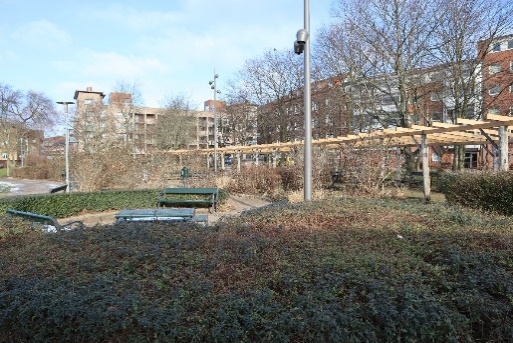
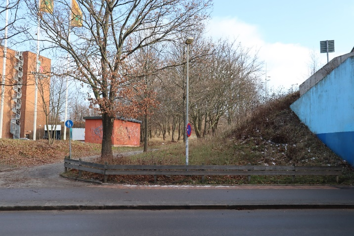

<!DOCTYPE html>
<html lang=sv>

<head>
    <link rel="stylesheet" type="text/css" href="Style.css">
    <link rel="preconnect" href="https://fonts.gstatic.com">
    <link rel="preconnect" href="https://fonts.gstatic.com">
    <link href="https://fonts.googleapis.com/css2?family=Noto+Sans+JP:wght@300&display=swap" rel="stylesheet">
    <link href="https://fonts.googleapis.com/css2?family=Ubuntu:ital,wght@0,300;0,400;1,300&display=swap"
        rel="stylesheet">
    <title>Parkområdet</title>
</head>

<body>
    <ul class="navbarul">
        <li class="navbarli">
            <a class="navbar-brand" href="Index.html">
                

                    
                

            </a>
        </li>
        <li class="navbarli"><a href="index.html">Grönområdet</a></li>
        <li class="navbarli"><a href="Sanering.html">Sanering</a></li>
        <li class="navbarli"><a href="Gallery.html">Galleri</a></li>
    </ul>
 
    
 
        <h1 class="g_s">Grönområde</h1>
        <h3 class="g_s">Gåsebäck</h3>
    

    

        

              
            <header>Om Projektet</header>
            

              

                Gåsebäck är idag en stadsdel som behöver mycket nytt liv, därför så kommer vi att införa väldigt mycket grönområde i stadsdelen när vi gör om den. I Gåsebäck så kommer vi att införa ett stort grönområde som går igenom hela stadsdelen.
                I detta grönområde så kommer det genom hela att gå ett vattendrag som flödar genom stadsdelen. 
                  
                Vid mitten av detta vattenstråk, så kommer vi att sätta en park.
                I denna park så kommer det att finnas bland annat badplats, lekplats och grillplatser.
                Detta för att skapa en god sammanhållning i stadsdelen. I parkområdet så kommer det att finnas upplysta stigar, gångvägar och cykelvägar, som kan användas vid transport genom det nya Gåsebäck.  
                  
                Omgivningen kring grönområdet består av dels av ett torg, men det som främst omsluter 
                grönområdet är lägenhetshus. Kring parken så kommer det även att finnas gång och cykelbanor som kommer att fungera 
                som transport i, till och från stadsdelen och parken.  
            

        

         
    

        
    

    

          
        <header>Hållbarhetstänket</header>
          
  
        

            Det hållbarhetstänk som vi har är att vi utgår ifrån att stadsdelen ska ha mycket grönstruktur och därmed skapa en väldigt socialt hållbar stad, då där nu kommer att finnas platser att träffas och umgås med andra på utomhus. 
              
            Den nya grönstrukturen kommer göra att personerna som bor i området kommer att känna en större fröjd av att vistas utomhus runt om sin bostad. 
            Med detta grönområde vill vi skapa en hållbar stadsdel som värnar om sina invånares hälsa, psykiskt, fysiskt och socialt.  
          
 
    

       

         
    

    

         
        <header>Innehhåll & Trygghet</header>
        
  
        

            Hela vår del är ett grönområde och kommer därför att innehålla många buskar, träd, gång/cykelvägar, 
            badplats, grillplats, lekplats med mera. Detta för att skapa en plats där människor kan umgås och för att skapa en
            bättre trivsel i området. 
              
            I området så kommer det att finna mycket belysning, detta för att skapa en större trygghet i 
            området. Även bänkar kommer att vara utplacerade runt om i parken och även längst med gångbanorna i grönområdet.
            Detta görs för att skapa platser för befolkningen kan vara och känna sig trygga på.    
          
 
    

       

         
    

   
    <footer>
        
Thoren innovation school

        

            
Creators: Kais Atta Torkmani & Mateusz Rzepecki

        

    </footer>
</body>
</html>